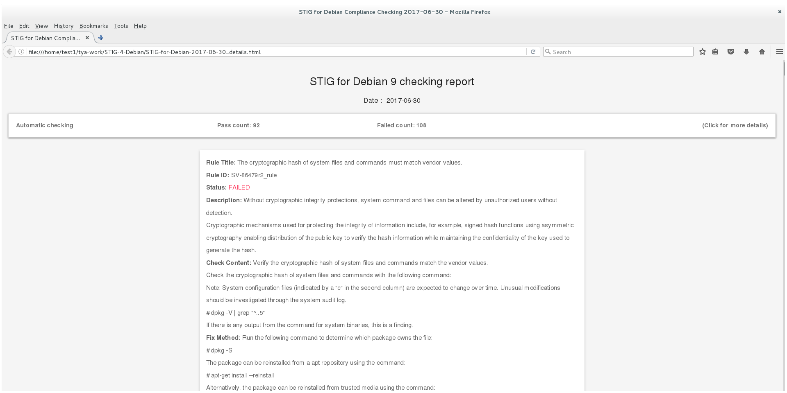
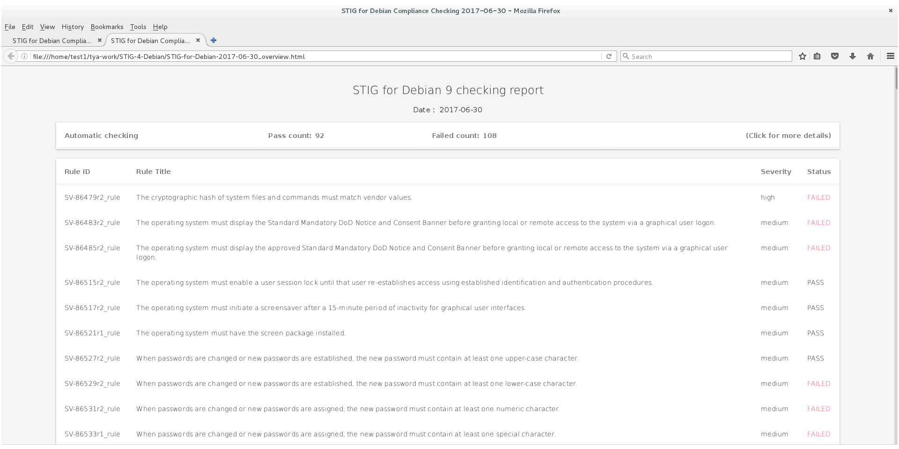

# STIG for Debian

## About

This script is used to check DISA STIG(Security Technical Implementation Guides) for Debian 9
Porting from [DISA RHEL 7 STIG V1 R1](http://iasecontent.disa.mil/stigs/zip/U_Red_Hat_Enterprise_Linux_7_V1R1_STIG.ZIP)  
Benchmark Date: 27 Feb 2017

## Upgrade

It has been a long time since we have updated STIG for Debian's framework. I think it's time to upgrade for the release of Debian 9 stable.

## HTML report output supported

For easy to read reports, we decided to output to HTML as the primary (and for now, only) option.

Thanks to the author [zavoloklom](https://github.com/zavoloklom) for the HTML table template

## Usage

```
# bash stig-4-debian.sh -h

usage: stig-4-debian.sh [options]

  -s    Start checking and output repot in html format.
  -v    Display version
  -h    Display help

Default report is output in current directory(STIG-for-Debian-*.html)

STIG for Debian Compliance Checking Tools (v2.0)

Ported from DISA RHEL 7 STIG

```

### Run on the GNOME desktop environment 


### Details of the report output 


### Overview of the report output  



## How to get involved

This is a new framework release only. Not many check rules have been ported from DISA RHEL 7 STIG yet.

We (and you) will fill it up soon.

### How to add check rule:
  1. Create a new check script file in the scripts directory for the new check rule and implementation.
  1. Move new check rule description to stig-debian.txt.
  1. Call the check script file in stig-4-debian.sh, as follows:

```
bash scripts/${new-check-rule-script}.sh >/dev/null 2>&1 &
spinner $!
output "SV-id_rule" $?
```

### How to delete a check rule:
  1. Delete check rule description from stig-debian.txt.  
  1. Delete the check script file in the scripts directory.  
  1. Delete calls the check script line in stig-4-debian.sh.  

#### Example
 
```
bash scripts/check-nullok.sh >/dev/null 2>&1 &
spinner $!
output "SV-86561r1_rule" $?
```

In this code snippet, we using a script name `check-nullok.sh` to check nullok in system-auth-ac and use exit status to determine the results of the check:

`spinner $!` is a small function for administrator to feel this script is running ;)

`output "SV-86561r1_rule" $?` using `output` function to output.

When the script is ported, note that the original text is from DISA RHEL 7 STIG. If some rule is RHEL 7 specific, you should use a corresponding check method in Debian and update the textfile `stig-debian.txt`.

If you encounter some rule that you cannot easily write a small script to check. You can put this rule in `manual.txt`.


#### Addition

In the `statics` directory `xml2text.sh` is a script that can extract the information we need from offcial STIG XML file, such as 'U_Red_Hat_Enterprise_Linux_7_STIG_V1R1_Manual-xccdf.xml'. The original text file `stig-debian.txt` is copy of `stig-rhel-7.txt`. How to easily update STIG for Debian textfile when the offcial RHEL 7 STIG changes is under discussion.

#### Special Note:

SELinux-related items (not matched):
 
* SV-86663r1_rule
* SV-86695r2_rule
* SV-86759r3_rule
* SV-86761r3_rule
* SV-86763r3_rule
* SV-86765r3_rule
* SV-86595r1_rule
* SV-86615r2_rule

## Get deb package 
### Signed package address 
https://github.com/harbian/stig4debian/tree/master/stig4debian-package

### Unsigned package address
https://github.com/harbian/stig4debian/tree/master/stig4debian-unsigned-package 

